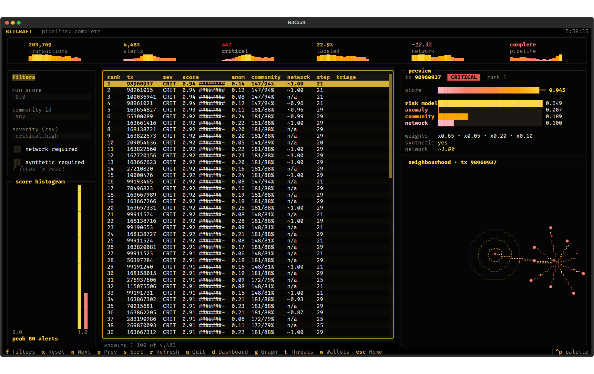
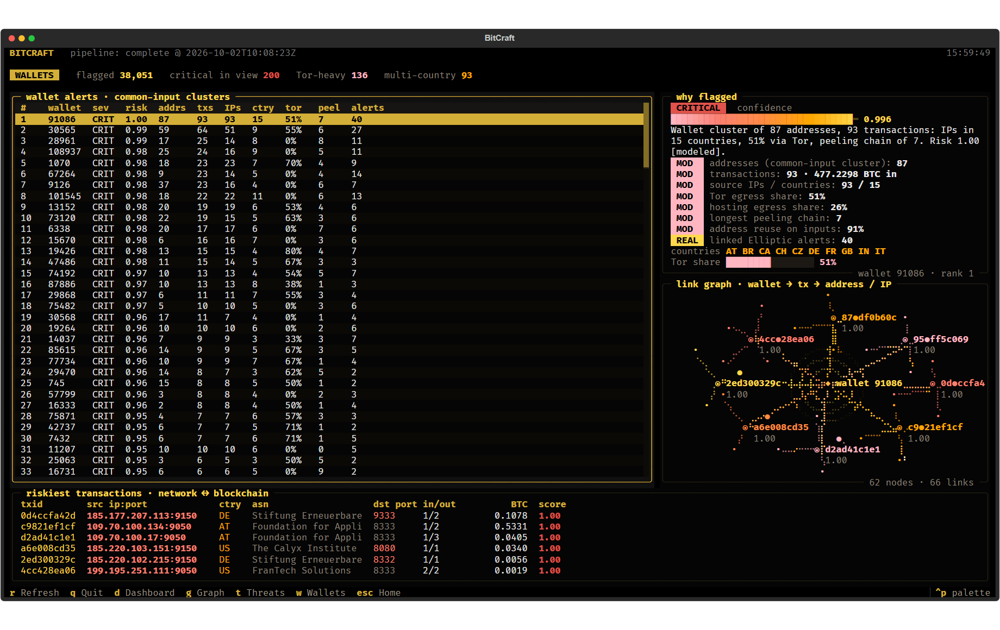
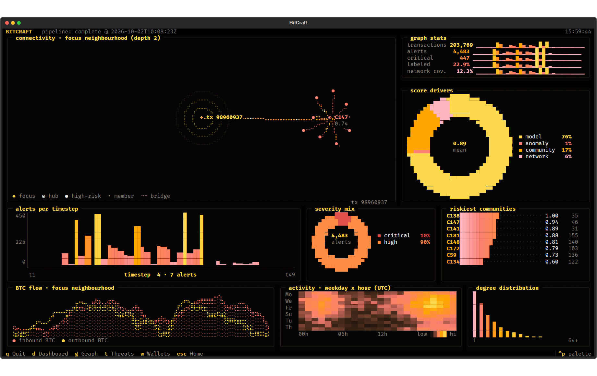

# BitCraft

AI Powered Monitoring & Analysis of Bitcoin Transaction Traffic Software

BitCraft is an offline Bitcoin intelligence platform that correlates blockchain transactions with network metadata to generate explainable investigative leads. It ingests bulk transaction datasets, builds an entity graph linking wallets, IPs, and transactions, applies AI and graph analysis to detect suspicious behavior, and presents prioritized alerts through a terminal-based investigation dashboard (TUI).

The project is designed for Linux and operates entirely offline on synthetic datasets modeled after real Bitcoin transaction and P2P network activity.

---



| Wallets | Graph explorer |
| --- | --- |
|  |  |

## Background

Bitcoin's pseudonymous peer to peer architecture enables legitimate financial activity, but it also allows ransomware payments, darknet market proceeds, extortion, and money laundering to move across the network with limited traditional financial oversight.

BitCraft addresses this challenge by combining blockchain layer data with network layer observations. Instead of analyzing transactions in isolation, it reconstructs relationships between wallets, IP addresses, and transaction timing to uncover suspicious patterns that would otherwise remain hidden.

---

## Features

- Bulk ingestion of CSV, JSON, and XML datasets
- Bitcoin transaction and metadata parsing
- Entity graph connecting wallets, IPs, ports, and transactions
- AI powered anomaly detection
- Wallet and transaction clustering
- Explainable alerts with confidence scores
- Terminal-based investigation dashboard (TUI) for link analysis
- Fully offline Linux compatible workflow

---

## Dataset

BitCraft works with synthetic datasets modeled on real Bitcoin transaction fields.

### Supported Fields

- `timestamp`
- `src_ip`
- `dst_ip`
- `src_port`
- `dst_port`
- `txid`
- `input_addresses[]`
- `output_addresses[]`
- `input_amounts[]`
- `output_amounts[]`
- `fee`
- `script_type`
- `geo_country`
- `asn`

GeoIP enrichment uses downloadable open source GeoIP databases.

---

## Objectives

- Ingest and parse bulk Bitcoin transaction metadata.
- Correlate network layer and blockchain layer data.
- Build relationships between wallets, IP addresses, and transactions.
- Detect suspicious behavior using AI and machine learning.
- Generate explainable alerts with confidence scores.
- Provide investigators with a clear view of suspicious entities through a terminal-based dashboard.

---

## AI and Graph Analysis

BitCraft combines graph analytics with machine learning rather than relying solely on rule based detection.

Planned capabilities include:

- Entity clustering
- Transaction anomaly detection
- Suspicious transaction chain identification
- Temporal behavior analysis
- Wallet relationship discovery
- Network correlation between blockchain activity and observed IP metadata

Every alert includes supporting evidence and a confidence score.

---

## Project Structure

```text
bitcraft/
├── datasets/
├── docs/
├── plans/
├── src/
├── tests/
└── README.md
```

---

## Getting Started

### Install and run

```text
pip install bitcraft          # any OS, Python 3.10+
choco install bitcraft        # Windows (Chocolatey)
bitcraft                      # opens BitCraft in a new, large terminal window
```

From a clone, `pip install -e .` gives you the same `bitcraft` command, or
run `bitcraft.bat` / `./bitcraft.sh` / `./bitcraft.ps1` straight from the repo
root without installing anything.

| Command | What it does |
| --- | --- |
| `bitcraft` | New window (Windows Terminal, else Command Prompt; gnome-terminal, konsole, kitty, alacritty or xterm on Linux; Terminal.app on macOS) |
| `bitcraft demo` | Same, with built-in demo data |
| `bitcraft here` | Run inside the current terminal |
| `bitcraft status` | Check the API and the last pipeline run |
| `bitcraft run --api-url URL --size 200x60` | Pick a backend and window size |

Inside a source checkout with a loaded database, `bitcraft` also starts the
API in the background and stops it when you quit. Release builds:
`python packages/build_package.py` (wheel, sdist and the Chocolatey
package).

### Model and backend (live data)

The dataset is the private Kaggle dataset
`rosalinnayak/bitcoin-transaction-traffic`. Put its five CSVs in
`datasets/` (git-ignored), then:

```text
pip install -r requirements.txt -r backend/requirements.txt
python -m ml.geoip download               # one-time: DB-IP Lite country + ASN databases
python -m ml.metadata_generator           # challenge-format metadata (CSV, JSON, XML)
python -m ml.pipeline                     # ~5 min first run, writes ml/artifacts/
cd backend && python -m app.loader        # loads artifacts into backend/bitcraft.db
bitcraft                                  # starts the API and opens the TUI
```

The metadata layer carries the challenge's minimum fields (timestamp,
src/dst IP and port, txid, input/output addresses and amounts, fee, script
type). `python -m ml.ingest FILE` validates any CSV, JSON or XML file in
that shape; GeoIP adds country and ASN offline.

With no `DATABASE_URL` the API uses a local SQLite file, and Redis is
optional. For the full PostgreSQL + Redis stack, use `docker compose up --build`:
the `ml` service runs the pipeline, then `backend` loads the results and
serves on port 8000.

API: `/alerts`, `/alerts/{tx_id}`, `/graph/{tx_id}?depth=`, `/communities`,
`/communities/{id}`, `/entities`, `/entities/{id}`, `/entities/{id}/graph`,
`/addresses/{address}`, `/ips/{ip}`, `/metadata/{tx_id}`, `/stats/summary`,
`/threats/overview`, `/pipeline/status`, `/pipeline/metrics`. Interactive docs
at `http://localhost:8000/docs`.

Full instructions: [docs/user_manual.md](docs/user_manual.md). Approach,
model choice and explainability: [docs/technical_writeup.md](docs/technical_writeup.md).
Model details and held-out metrics: [docs/model_card.md](docs/model_card.md).

### Terminal UI (demo mode)

```text
pip install -r bitcraft/requirements.txt
python -m bitcraft.app --demo
```

Other data sources:

```text
python -m bitcraft.app --api
python -m bitcraft.app
```

`--demo` forces synthetic data. `--api` talks to FastAPI at
`http://localhost:8000` (override with `--api-url`). Default `auto`
probes `/health` and falls back to demo.

Keys: Enter (boot/detail), d dashboard, t threats, g graph, Esc home, q quit.

Demo mode always shows a `DEMO DATA` badge. It is not live pipeline output.

Minimum terminal size: 100 columns by 30 rows.

---

## Expected Output

BitCraft produces:

- Parsed and correlated transaction data
- Entity relationship graphs
- Ranked suspicious wallets and transactions
- Explainable AI generated alerts
- Terminal-based investigation dashboard (TUI)

---

## Tech Stack

Planned technologies include:

- Python
- NetworkX
- FastAPI
- PostgreSQL
- Redis
- GeoIP databases
- Machine learning libraries
- Textual (terminal UI framework)

---

## License

BitCraft is open source under the [Apache License 2.0](LICENSE).

Copyright 2026 The BitCraft Authors: Rohan Pattanayak, Jagadish Pattnaik,
Shreya Mishra, Shreya Mohanty, Ashutosh Badapada and Rosalin Nayak.
See [NOTICE](NOTICE).

The Elliptic-derived dataset is distributed separately and is not covered
by this license.