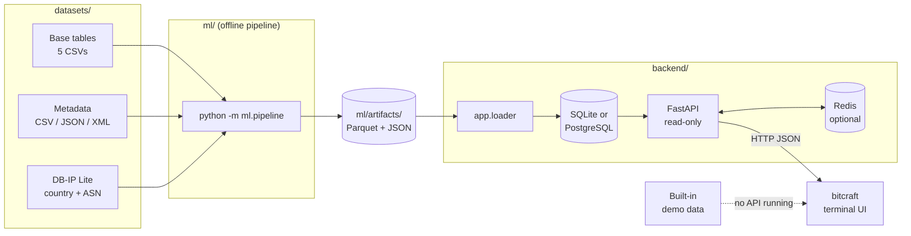
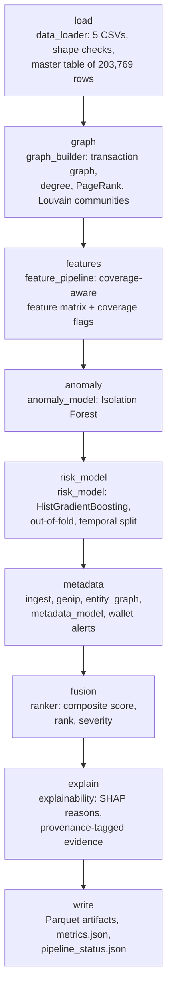
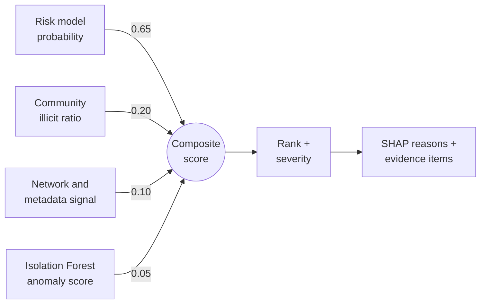
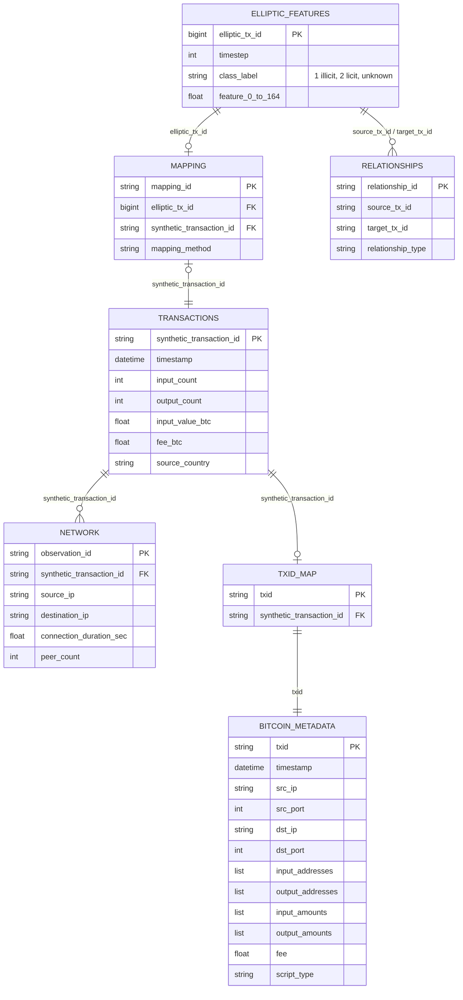
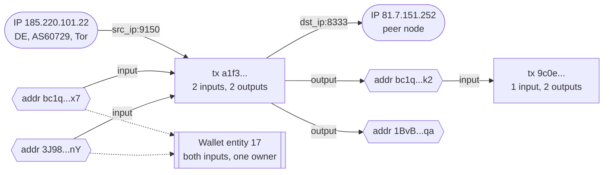
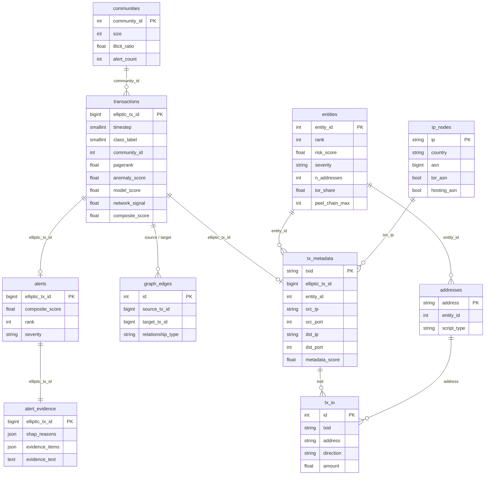
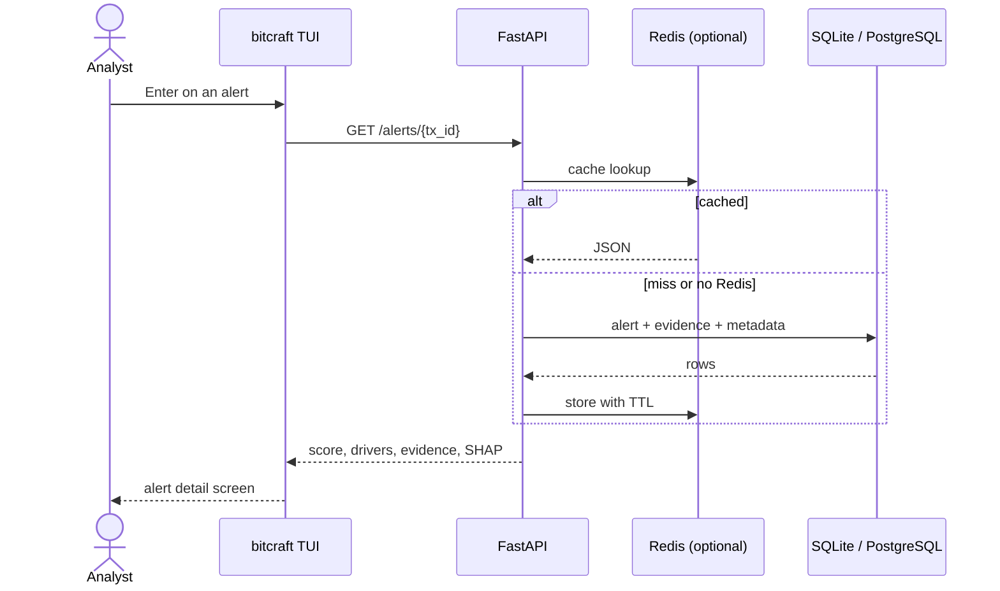
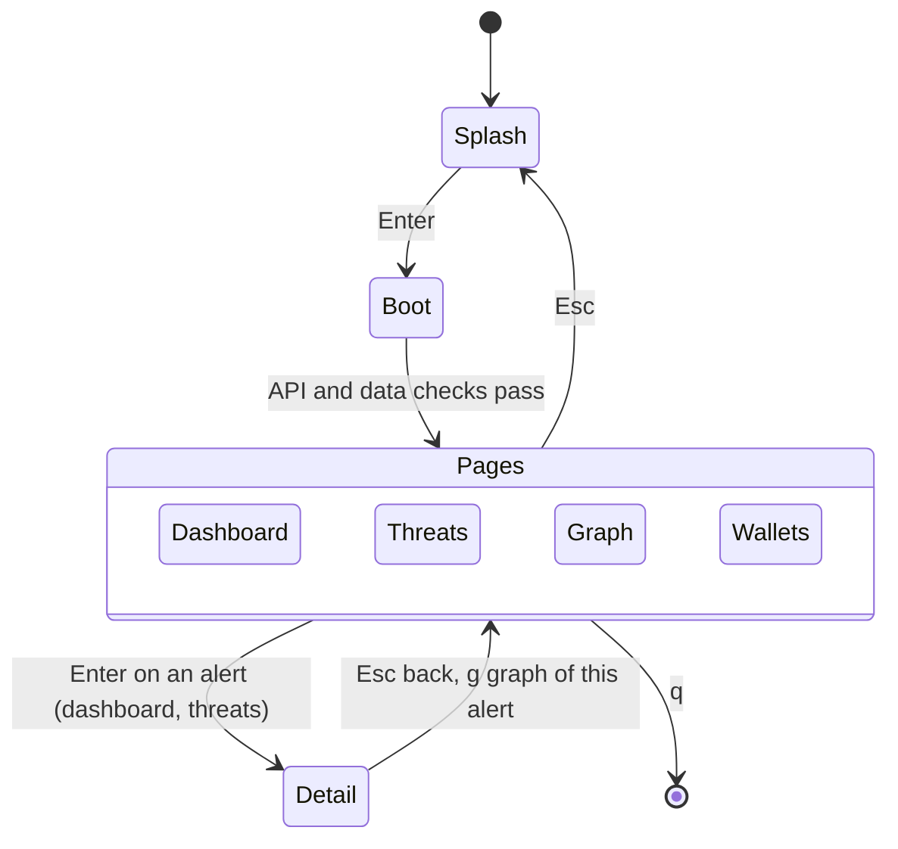
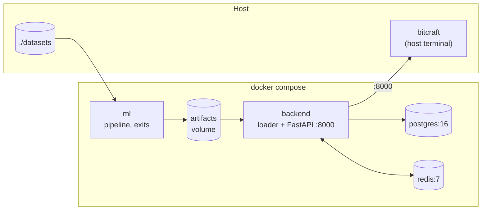

# BitCraft Architecture

How data moves from raw files to ranked, explainable alerts in the
terminal. The diagrams render on GitHub (Mermaid).

## System overview

Three parts, joined only by files and a read-only API:

- `ml/` runs offline, once per dataset: ingestion, enrichment, graphs,
  models, fusion and explanations. It writes Parquet artifacts and exits.
- `backend/` loads the artifacts into SQLite or PostgreSQL and serves them
  through a read-only FastAPI service, with an optional Redis cache.
- `bitcraft/` is the Textual terminal interface. It reads the API, or
  built-in demo data when no API is running.

No model runs at request time, so the API stays fast and every number
the analyst sees can be traced back to one pipeline run.

Getting the data: `python -m ml.dataset download` fetches all of
`datasets/` from the GitHub release, and `python -m ml.synthetic`
generates a fully synthetic copy instead (see `docs/user_manual.md`,
section 3).

## Pipeline stages

`ml/pipeline.py` runs these stages in order. Each stage name is written
to `pipeline_status.json` as it starts, which `GET /pipeline/status` and
the boot screen read.

The metadata stage is skipped, with a log line, when `datasets/metadata/`
is missing; the rest of the pipeline still runs.

## Score fusion

Every transaction gets one composite score in [0, 1]. The weights live in
`ml/config.yaml`; `docs/model_card.md` explains why the supervised risk
model leads.

Leakage guards: labels with timestep 34 or earlier train the risk model
and feed the community ratios; timesteps 35 to 49 are held out for
evaluation, and training scores are out-of-fold.

## Dataset relationships

The base dataset is five tables. `elliptic_features.csv` is the universe
of 203,769 transactions; the synthetic transaction layer covers 50,000 of
them through `mapping.csv`, and network observations hang off the
synthetic layer. The challenge-format metadata links back through
`txid_map.csv`.

| Table | Rows | Key |
| --- | ---: | --- |
| `elliptic_features.csv` | 203,769 | `elliptic_tx_id` |
| `transactions.csv` | 50,000 | `synthetic_transaction_id` |
| `network.csv` | 40,854 | `observation_id` |
| `mapping.csv` | 50,000 | `mapping_id` |
| `relationships.csv` | 245,856 | `relationship_id` |
| `metadata/bitcoin_metadata.*` | 50,000 | `txid` |

Two ID namespaces never mix: `elliptic_tx_id` (integers) and
`synthetic_transaction_id` (`SYN_TX_...`), joined only through
`mapping.csv`. Which fields are real and which are synthetic is in
`docs/dataset_provenance.md`.

## Entity graph

The metadata layer links IP addresses, transactions and Bitcoin addresses.
Addresses spent together as inputs of one transaction belong to the same
owner (common-input ownership, union-find in `ml/entity_graph.py`), which
groups them into wallet entities.

Wallet risk combines the riskiest transaction with a shrunk mean over all
of its transactions, so one bad transfer stands out without small
wallets swinging to extremes. Wallet features (Tor and hosting share,
countries per day, peel-chain length, round outputs, address reuse) feed
the metadata model; `GET /entities/{id}/graph` returns this graph for
one wallet.

## Database model

`backend/app/loader.py` recreates these tables from the artifacts on
every load. The transaction side is keyed by `elliptic_tx_id`, the
metadata side by `txid` and `entity_id`; `tx_metadata.elliptic_tx_id`
joins the two.

## Request flow

The API answers from the cache when Redis is running and from the
database otherwise. Missing network evidence comes back as `null` and is
shown as `n/a`, never as low risk.

API routes: `/alerts`, `/alerts/{tx_id}`, `/graph/{tx_id}`,
`/communities`, `/communities/{id}`, `/entities`, `/entities/{id}`,
`/entities/{id}/graph`, `/addresses/{address}`, `/ips/{ip}`,
`/metadata/{tx_id}`, `/stats/summary`, `/threats/overview`,
`/pipeline/status`, `/pipeline/metrics`. Interactive docs at `/docs`.

## Terminal interface

On any page, `d`, `t`, `g` and `w` switch to the dashboard, threats,
graph explorer and wallets. When the API is unreachable, the boot screen
offers a retry or the demo data. Screen layouts and theme:
`docs/tui_design.md`.

## Deployment

`docker compose up --build` runs the whole stack on Linux. The `ml`
service runs the pipeline once and exits; the backend waits for it to
finish, loads the artifacts into PostgreSQL and serves on port 8000.

For a machine with no network, `python packages/offline_bundle.py` builds
a folder with every wheel, Docker image and dataset, installed there with
`bash install.sh` (`docs/user_manual.md`, section 8).

## Repository map

| Path | Role |
| --- | --- |
| `ml/data_loader.py` | Load and validate the five CSVs, build the master table |
| `ml/graph_builder.py` | Transaction graph, PageRank, Louvain communities |
| `ml/feature_pipeline.py` | Coverage-aware feature matrix |
| `ml/anomaly_model.py` | Isolation Forest |
| `ml/risk_model.py` | Supervised risk model with temporal split |
| `ml/ingest.py` | CSV, JSON, JSON Lines and XML ingestion with validation |
| `ml/geoip.py` | Offline country and ASN lookups |
| `ml/entity_graph.py` | IP, address and transaction graph; wallet clustering |
| `ml/metadata_model.py` | Metadata model and wallet alerts |
| `ml/ranker.py` | Score fusion, ranking, severity |
| `ml/explainability.py` | SHAP reasons and evidence items |
| `ml/dataset.py`, `ml/synthetic.py` | Dataset download and synthetic generation |
| `backend/app/loader.py` | Artifacts into the database |
| `backend/app/api/` | Route handlers; `services/` holds the queries |
| `bitcraft/` | Terminal interface and the `bitcraft` command |
