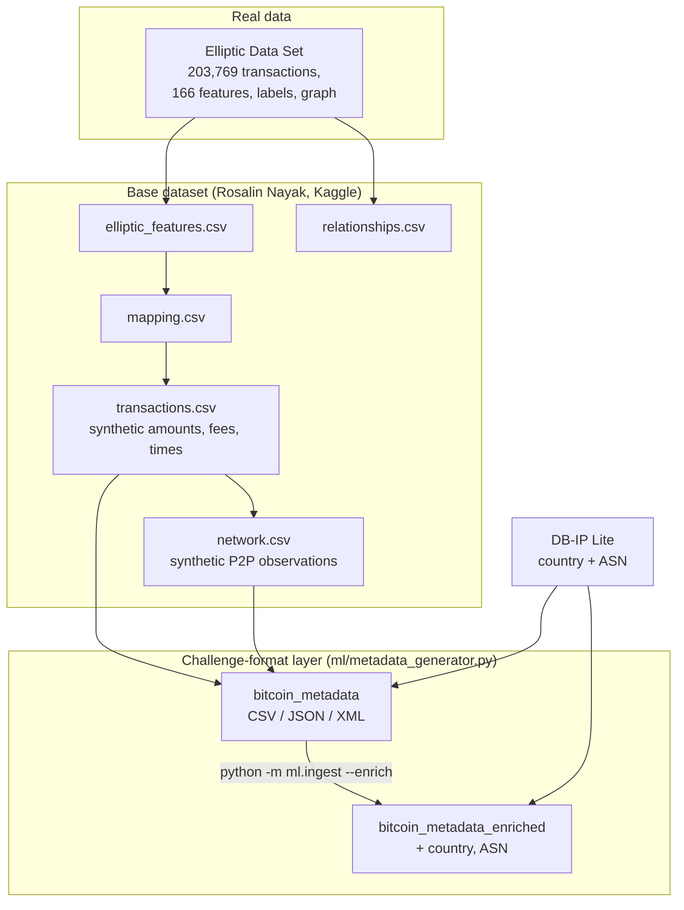

# Dataset Provenance

What every BitCraft dataset is, where it comes from, and which values
are real and which are synthetic.

## Source

`bitcraft_consolidated_v1`, random seed 42.

Combines real, labeled Bitcoin transaction data from the Elliptic dataset
with synthetically generated transaction and P2P network layers.

## Sources

| Source | Used for | License |
| --- | --- | --- |
| [Bitcoin Transaction traffic](https://www.kaggle.com/datasets/rosalinnayak/bitcoin-transaction-traffic) (Rosalin Nayak, Kaggle) | The five base tables | Apache 2.0 (`datasets/LICENSE`) |
| [Elliptic Data Set](https://www.kaggle.com/datasets/ellipticco/elliptic-data-set) | Transaction features, labels and graph | Upstream research terms |
| [blockchain-etl/bitcoin-etl](https://github.com/blockchain-etl/bitcoin-etl) | Transaction field schema (txid, inputs, outputs, values, fees, timestamps) | MIT |
| Schnoering and Vazirgiannis, [Bitcoin Research with a Transaction Graph Dataset](https://arxiv.org/abs/2411.10325) (2024) | Transaction graph research dataset | CC BY-SA 4.0 |
| [DB-IP Lite](https://db-ip.com) | GeoIP country and ASN | CC BY 4.0 |

Full attributions: `datasets/NOTICE`.

## Distribution

The data is attached to the GitHub release as three zip archives, each
carrying `datasets/LICENSE` and `datasets/NOTICE`:

| Archive | Contents |
| --- | --- |
| `bitcraft-base.zip` | The five base tables |
| `bitcraft-metadata.zip` | Metadata in CSV, JSON and XML, GeoIP-enriched versions, `txid_map.csv`, `generator_truth.csv` |
| `bitcraft-geoip.zip` | DB-IP Lite country and ASN databases, IP pool cache |

`python -m ml.dataset download` fetches them and verifies each against the
SHA-256 in `ml/references/dataset_manifest.json`. `python -m ml.synthetic`
generates an entirely synthetic dataset in the same format instead.

## Tables

| Table | Shape | Primary key | Linkage | Origin |
| --- | ---: | --- | --- | --- |
| `elliptic_features.csv` | 203,769 x 170 | `elliptic_tx_id` | Ground-truth features and labels | Real (Elliptic) |
| `relationships.csv` | 245,856 x 6 | `relationship_id` | `source_tx_id`, `target_tx_id` | 234,355 real Elliptic edges, 11,501 synthetic temporal links |
| `mapping.csv` | 50,000 x 6 | `mapping_id` | `elliptic_tx_id` to `synthetic_transaction_id` | Statistical, timestep matched |
| `transactions.csv` | 50,000 x 16 | `synthetic_transaction_id` | Through `mapping.csv` | Synthetic |
| `network.csv` | 40,854 x 13 | `observation_id` | `synthetic_transaction_id` | Synthetic |

The relationship diagram for these tables is in `docs/architecture.md`.

## Coverage

| Measure | Value |
| --- | ---: |
| Transactions (Elliptic universe) | 203,769 |
| With a synthetic transaction record | 50,000 (about 24.5%) |
| Network observations | 40,854 |
| Full coverage: features, amounts and network | about 12% |
| Known labels | 22.9% (2.2% illicit, 20.6% licit) |
| Unknown labels | 77.1% |

Coverage drives every score: a transaction without network data gets no
network signal and shows `n/a`, never a low score.

## Metadata layer (challenge format)

`ml/metadata_generator.py` builds one record per transaction in
`transactions.csv` with the problem statement's minimum fields (timestamp,
src/dst IP and port, txid, input/output addresses and amounts, fee, script
type), written as CSV, JSON and XML under `datasets/metadata/`.

- Real (from the dataset): timestamps, input/output counts, BTC values,
  fees, labels, and the countries of observed P2P connections.
- Synthesised: wallet owners and their addresses (valid checksums), txids,
  routable IPs drawn from each country's real address blocks, ports, and
  per-address amounts.
- Planted with noise, mostly on illicit-labeled transactions: address
  reuse, peeling chains, CoinJoin-style mixing, Tor and hosting egress,
  multi-country IP hopping, non-standard ports, round payouts.
  `generator_truth.csv` records what was planted, for validation only.

## GeoIP

Country and ASN come from DB-IP Lite (country and ASN, MMDB format), used
offline after a one-time download (`python -m ml.geoip download`).
IP geolocation by DB-IP (<https://db-ip.com>), licensed CC BY 4.0. The
databases are not in the git repository; the release archive
`bitcraft-geoip.zip` redistributes them with this attribution.
