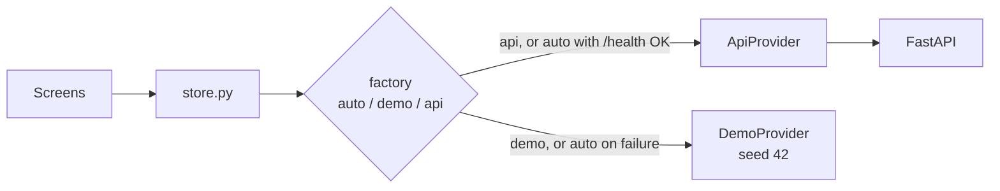

# BitCraft TUI Design

Status: complete. Splash, boot, dashboard, threats, graph explorer,
wallets and alert detail all read the live API, with built-in demo data
as the fallback. Navigation and data flow diagrams are in
`docs/architecture.md`.

## Why a Terminal Interface

BitCraft is an offline, air-gapped system (`plans/plan.md` section 1). A
terminal interface needs no browser, no web server, and no client-side
build step, so it drops cleanly into the same offline Linux container as
the rest of the pipeline.

## Framework

Textual (Python). Floor: `textual>=5.0` for `App.MODES` / `switch_mode`.

## Visual Theme: Pitch Black

| Role | Color | Use |
|---|---|---|
| Background | `#000000` | Screen, header, footer |
| Panel background | `#050505` | Panel bodies |
| Border | `#1a1a1a` | Panel outlines |
| Primary text | `#e6e6e6` | Body text |
| Accent | `#d4af37` | Headers, medium severity, focus |
| High severity | `#b3261e` | High/critical alerts only |
| Muted | `#7a7a7a` | Footer, low severity |
| Modeled badge | `#6a6a6a`, italic | Synthetic-layer values |

## Mascot

A gold pixel frog (`bitcraft/widgets/mascot.py`, art in
`bitcraft/assets/mascots/`), drawn with half-block characters at its
native 56-column width. It appears only on the splash and boot screens;
data pages stay free of decoration.

| Mood | When |
|---|---|
| happy | Splash, and boot once every check passes |
| thinking | Boot checks running |
| confused | Boot failed (API unreachable or pipeline not run) |
| neutral, sleepy, shocked, angry | Splash idle cycle |

On the splash it hides when the terminal is under 34 rows.

## Provider layer

Screens read only from `bitcraft/store.py`. The store holds a
`DataProvider` (`bitcraft/providers/`):

- `DemoProvider`: deterministic seed 42, plan-aligned coverage numbers
- `ApiProvider`: FastAPI via `bitcraft/api_client.py`
- Selection: `BITCRAFT_DATA_SOURCE=auto|demo|api`, or `--demo` / `--api`



`auto` probes `/health` (1.5s) and falls back to demo on failure.

## Provenance glyphs

- `~` prefix and `.modeled-badge` = modeled / synthetic-layer value
- `n/a` = no network coverage (never show `0` / `0.00` as risk)
- `DEMO DATA` badge in the header whenever the demo provider is active

## Severity

Set by `ml/ranker.py` (`SEVERITY_THRESHOLDS`) and shown as is:

| Tier | Composite score |
|---|---|
| critical | >= 0.80 |
| high | >= 0.60 |
| medium | >= 0.40 |
| low | < 0.40 |

## Screens

| Screen | Key | Role |
|---|---|---|
| Splash | launch | Logo and frog |
| Boot | after Enter | Data source, pipeline and alert checks, then dashboard |
| Dashboard | `d` | KPIs, filters, ranked alerts, live preview |
| Threats | `t` | Posture, top-25 queue with drivers, riskiest communities, coverage gaps |
| Graph | `g` | Braille connectivity graph with timestep, severity, driver and community charts |
| Wallets | `w` | Address clusters with their IPs, ports, GeoIP country and ASN, link graph |
| Alert detail | Enter on an alert | Composite score, drivers, network and blockchain metadata, evidence, SHAP |

## Key map

| Key | Action |
|---|---|
| Enter | Splash: boot; table: detail |
| d | Dashboard |
| t | Threats |
| g | Graph (from an alert: its neighbourhood) |
| w | Wallets |
| Esc | Detail: back; pages: home (splash) |
| q | Quit |
| n / p | Next / previous alert page |
| s | Cycle sort |
| f / x | Focus filters / reset |
| r | Refresh |
| a / c / n | Threats: driver filters |
| 1 / 2 / 3 / 4 | Threats: all, critical, high, medium |

## Run

```text
pip install bitcraft
bitcraft demo          # new sized window, demo data
bitcraft               # new window, API with demo fallback
bitcraft here --api    # current terminal, API required
```

Minimum terminal size: 100x30, below which a guard panel is shown;
160x46 or larger shows every panel at full width.
`BITCRAFT_ASCII=1` forces plain ASCII glyphs.
