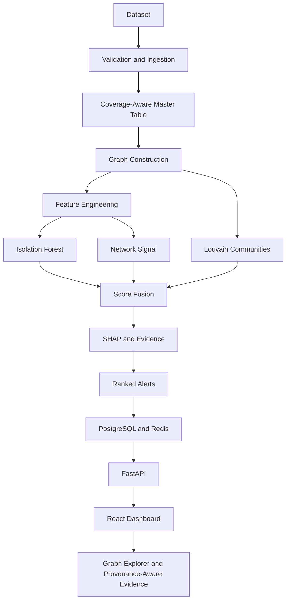

# BitCraft - Implementation Plan

> **AI-Powered Monitoring & Analysis of Bitcoin Transaction Traffic**  
> Smart India Hackathon 2026 - Problem Statement **SIH26146**  
> Organisation: **National Technical Research Organisation (NTRO)**  
> Theme: **Blockchain & Cybersecurity**

---

## 1. Project Overview

BitCraft is an offline, Linux-only system that ingests a consolidated Bitcoin transaction dataset, builds a transaction-level entity graph, applies unsupervised AI/ML to score anomalies and detect communities, and surfaces ranked, explainable alerts through an investigation dashboard.

The system runs entirely air-gapped:

- No live blockchain API calls
- No cloud inference
- No external network calls at judging time

The implementation is based on `bitcraft_consolidated_v1` with random seed `42`, combining real, labeled Bitcoin transaction data from the Elliptic dataset with synthetically generated transaction and P2P network layers.

---

## 2. Implementation Principles

The following rules are part of the implementation and must be preserved throughout development.

### 2.1 Dataset as Ground Truth

All ingestion, feature engineering, and graph code must be written directly against the specified dataset shapes and dtypes.

### 2.2 Coverage-Aware Processing

The master table must preserve whether a transaction has synthetic and/or network-layer coverage.

- Use `has_synthetic_layer` as an explicit boolean.
- Use `has_network_layer` as an explicit boolean.
- Missing synthetic-layer values must use a neutral sentinel with a separate missing indicator where required.
- Missing network aggregates must remain `null` and be gated by the coverage flag.
- Missing network evidence must never be interpreted as zero risk.

### 2.3 Provenance

`data_source`, `generation_method`, and `mapping_method` must be carried through joins into the final alert evidence.

`mapping.csv` is a statistical linkage only. A mapping between an Elliptic transaction and a synthetic transaction does **not** mean that the synthetic fields were observed for that real transaction.

Synthetic-layer values must therefore never be presented in the UI or scoring logic as observed facts about the corresponding real transaction.

### 2.4 ID Namespace Separation

The two transaction ID namespaces must remain separate:

- `elliptic_tx_id`: `int64`
- `synthetic_transaction_id`: `SYN_TX_*` string

They must never be merged into one join key. Graph edges must remain within their respective relationship-type namespaces.

---

# 3. Dataset and Data Architecture

## 3.1 Dataset Tables

| Table | Shape | Primary Key | Linkage |
|---|---:|---|---|
| `elliptic_features.csv` | 203,769 × 170 | `elliptic_tx_id` | Ground-truth transaction features |
| `transactions.csv` | 50,000 × 16 | `synthetic_transaction_id` | Linked through `mapping.csv` |
| `network.csv` | 40,854 × 13 | `observation_id` | `synthetic_transaction_id → transactions.csv` |
| `mapping.csv` | 50,000 × 6 | `mapping_id` | `elliptic_tx_id`, `synthetic_transaction_id` |
| `relationships.csv` | 245,856 × 6 | `relationship_id` | `source_tx_id`, `target_tx_id` |

## 3.2 Important Coverage Facts

- Elliptic universe: **203,769 transactions**
- Synthetic transaction records: **50,000 (~24.5%)**
- Network observations: **40,854**
- Full-stack coverage across features + synthetic amounts + network: **~12%** of the transaction universe
- Known Elliptic labels: **22.9%**
- Unknown Elliptic labels: **77.1%**

The known labels are used for validation and community-level risk statistics, never as a supervised training target.

---

# 4. Master Table Construction

Build one master-table row for every `elliptic_tx_id`, resulting in **203,769 rows**.

### Base columns

Always retain:

- `elliptic_tx_id`
- `timestep`
- `feature_0 ... feature_164`
- `class_label`

### Synthetic layer

Join `transactions.csv` through:

`elliptic_tx_id → mapping.csv → synthetic_transaction_id`

Add:

- `has_synthetic_layer`
- Synthetic transaction fields where available

### Network layer

Join `network.csv` through `synthetic_transaction_id`.

Aggregate multiple observations per transaction using:

- Mean `connection_duration_sec`
- Mean `peer_count`
- Distinct source IP count
- Distinct destination IP count
- Distinct country count

Add:

- `has_network_layer`
- Network aggregate fields

### Graph features

Compute separately and join into the master table:

- `degree`
- `pagerank`
- `clustering_coefficient`
- `community_id`

---

# 5. Pipeline Architecture

The implementation must follow this staged pipeline.

| Stage | Component | Responsibility |
|---|---|---|
| 0 - Environment Setup | Docker | Offline Linux container, GeoLite2 reference data, `known_ranges.csv`, dataset baked into image |
| 1 - Ingestion | `ml/data_loader.py` | Load all 5 CSVs, validate dtypes/shapes, build master table |
| 2 - Enrichment | `ml/data_loader.py` | Add coverage flags and flag Tor-exit/hosting-provider ASNs |
| 3 - Graph Construction | `ml/graph_builder.py` | Build transaction graph from `relationships.csv` |
| 4 - Feature Engineering | `ml/feature_pipeline.py` | Assemble coverage-aware feature matrix |
| 5 - AI/ML Detection | `ml/anomaly_model.py`, `ml/graph_builder.py` | Isolation Forest anomaly scoring + Louvain communities |
| 6 - Explainability | `ml/explainability.py` | SHAP TreeExplainer + provenance-tagged evidence |
| 7 - Alerting & Ranking | `ml/ranker.py` | Fuse scores into `composite_score` and write alerts |
| 8 - Dashboard | `frontend/` | Ranked alerts, graph explorer, evidence panel |
| 9 - Packaging | `docker-compose.yml` | One-command fully offline execution |

---

# 6. AI/ML Implementation

## 6.1 Feature Matrix

The full-coverage feature matrix is approximately **183 dimensions**:

### Elliptic features

- 165 anonymized features
- `timestep`

### Graph features

- `degree`
- `pagerank`
- `clustering_coefficient`
- `community_id`

### Synthetic-layer fields

- `input_count`
- `output_count`
- `input_value_btc`
- `output_value_btc`
- `fee_btc`
- `source_country`
- `source_asn`
- `destination_country`
- `destination_asn`

### Network aggregates

- `mean_connection_duration_sec`
- `mean_peer_count`
- `distinct-IP count`
- `distinct-country count`

### Coverage flags

- `has_synthetic_layer`
- `has_network_layer`

---

## 6.2 Branch A - Isolation Forest

Use Isolation Forest as the unsupervised anomaly detector.

Configuration:

```yaml
n_estimators: 300
max_samples: "auto"
contamination: 0.022
```

Requirements:

- Score all **203,769** transactions.
- Train without using `class_label`.
- `contamination=0.022` is used as a scoring prior matching the known illicit rate.
- The class label must never be used as a model training target.

---

## 6.3 Branch B - Graph + Louvain

Build the transaction-to-transaction graph from the **245,856** relationships.

Use Louvain community detection.

For every transaction, produce:

- `degree`
- `pagerank`
- `clustering_coefficient`
- `community_id`

Also calculate:

`community_illicit_ratio`

This is calculated per community using only the labeled **22.9%** subset of Elliptic transactions in that community.

It is a community-level population statistic, not a per-transaction ground-truth label.

---

# 7. Score Fusion

Use the following composite score:

```text
composite_score =
    0.60 * anomaly_score
  + 0.25 * community_illicit_ratio
  + 0.15 * network_ip_signal
```

### Network signal

For transactions without network coverage:

```text
network_ip_signal = 0
```

However, the dashboard must separately read `has_network_layer` so that:

- `0` score is not confused with
- unavailable network evidence.

The weights must live in:

```text
ml/config.yaml
```

They must be tunable against `precision@k` without changing code.

---

# 8. Explainability

Use SHAP `TreeExplainer` on the Isolation Forest.

SHAP should be computed only for the **top-N ranked alerts**.

Because Elliptic's 165 features are anonymized and have no published semantic mapping:

- SHAP explanations for these features remain feature-index-level.
- The primary human-readable explanation must be the evidence string.

Evidence should be built from:

- Community size
- `community_illicit_ratio`
- Degree percentile
- PageRank percentile
- Distinct IP counts
- Distinct country counts
- Top-ranked SHAP feature indices

Every evidence field must carry a provenance tag indicating whether it is:

- Real
- Modeled

---

# 9. Validation

The pipeline must include the following validation work.

## 9.1 Precision@k

Compute `precision@k` on the labeled **22.9%** subset of Elliptic transactions.

## 9.2 Injected Anomalies

Create a copy of the dataset and inject known anomalous patterns, including examples such as:

- Simulated peeling chain
- Rapid multi-geography IP hop within the synthetic layer

Confirm that the pipeline recovers the injected anomalies.

## 9.3 Stability

Re-run the pipeline under small input perturbations and confirm consistent flagging.

## 9.4 Community Quality

Evaluate Louvain community quality using the modularity score.

---

# 10. Backend Architecture

## 10.1 API Endpoints

| Endpoint | Method | Purpose |
|---|---|---|
| `/alerts` | GET | Paginated, filterable ranked alert list |
| `/alerts/{tx_id}` | GET | Full detail: scores, SHAP, evidence, coverage flags |
| `/graph/{tx_id}?depth=` | GET | Subgraph around one transaction |
| `/communities/{community_id}` | GET | Community members, size, illicit ratio |
| `/stats/summary` | GET | Dashboard KPIs |
| `/pipeline/status` | GET | Last/running ML pipeline job status through Redis |

## 10.2 PostgreSQL Schema

### `transactions`

Key columns:

- `elliptic_tx_id` - PK
- `timestep`
- `class_label`
- `has_synthetic_layer`
- `has_network_layer`

Populated by:

```text
ml/data_loader.py
```

### `alerts`

Key columns:

- `elliptic_tx_id` - FK
- `composite_score`
- `anomaly_score`
- `community_risk`
- `network_signal`
- `rank`

Populated by:

```text
ml/ranker.py
```

### `graph_edges`

Key columns:

- `source_tx_id`
- `target_tx_id`
- `relationship_type`
- `data_source`

Populated by:

```text
ml/graph_builder.py
```

### `communities`

Key columns:

- `community_id` - PK
- `size`
- `illicit_ratio`
- `mean_pagerank`

Populated by:

```text
ml/graph_builder.py
```

### `alert_evidence`

Key columns:

- `elliptic_tx_id` - FK
- `shap_reasons`
- `evidence_text`

Populated by:

```text
ml/explainability.py
```

## 10.3 Redis

Redis must:

- Cache the top-K alert list
- Cache hot filtered views
- Track pipeline job status

No ML code runs at request time.

The frontend reads pre-computed results only.

---

# 11. Frontend Architecture

## 11.1 Dashboard

Purpose:

- Display KPIs
- Display ranked alerts
- Support alert filtering

Components:

- `KpiSummary`
- `FilterSidebar`
- `AlertTable`

## 11.2 Alert Detail

Purpose:

- Display scores
- Display SHAP information
- Display evidence
- Display a mini-graph for one transaction

Components:

- `AlertDetailPanel`
- Embedded `GraphExplorer`

## 11.3 Graph Explorer

Purpose:

- Full link-analysis view
- Pan and zoom
- Visualize by score/community

Component:

- `GraphExplorer`

### Frontend stack

- React
- Vite
- Cytoscape.js **or** react-force-graph
- React Query
- Recharts

Synthetic-layer fields must be visually distinguished from real Elliptic-derived values using a badge or tooltip indicating that they are modeled.

---

# 12. Repository Structure

```text
bitcraft/
├── datasets/
│   ├── elliptic_features.csv
│   ├── transactions.csv
│   ├── network.csv
│   ├── mapping.csv
│   ├── relationships.csv
│   └── metadata.json
│
├── docs/
│   ├── architecture.md
│   ├── model_card.md
│   ├── dataset_provenance.md
│   └── technical_writeup.md
│
├── plans/
│   └── project_plan.md
│
├── ml/
│   ├── data_loader.py
│   ├── graph_builder.py
│   ├── anomaly_model.py
│   ├── feature_pipeline.py
│   ├── ranker.py
│   ├── explainability.py
│   ├── pipeline.py
│   ├── config.yaml
│   ├── models/
│   └── notebooks/
│
├── backend/
│   ├── app/
│   │   ├── main.py
│   │   ├── api/
│   │   ├── core/
│   │   ├── models/
│   │   ├── schemas/
│   │   └── services/
│   ├── alembic/
│   ├── requirements.txt
│   └── Dockerfile
│
├── frontend/
│   ├── src/
│   │   ├── components/
│   │   ├── pages/
│   │   ├── api/client.js
│   │   ├── App.jsx
│   │   └── main.jsx
│   ├── package.json
│   └── vite.config.js
│
├── tests/
│   ├── ml/
│   ├── backend/
│   └── frontend/
│
├── .gitignore
├── docker-compose.yml
└── README.md
```

---

# 13. Technology Stack

| Layer | Technology | Purpose |
|---|---|---|
| Core language | Python 3.11 | Fast prototyping and mature ML ecosystem |
| Data ingestion | Pandas, PyArrow | Handle the dataset comfortably in memory |
| Graph engine | NetworkX + python-louvain | In-memory transaction graph |
| Classical ML | scikit-learn / Isolation Forest | Unsupervised anomaly detection |
| Explainability | SHAP | TreeExplainer on Isolation Forest |
| Backend | FastAPI + Uvicorn | Async, offline-friendly API |
| Persistent store | PostgreSQL | Alerts, graph metadata, evidence |
| Cache / job status | Redis | Hot alert views and pipeline tracking |
| Frontend | React + Vite | Dashboard application |
| Graph visualization | Cytoscape.js or react-force-graph | Interactive link analysis |
| Charts | Recharts | KPI/data visualizations |
| Packaging | Docker + Docker Compose | One-command offline execution |
| Testing | Pytest | ML, ingestion, feature pipeline and model tests |

---

# 14. Stretch Goal

GraphSAGE / GNN embedding work is a **stretch goal only**.

It must be attempted **after** the Isolation Forest + Louvain baseline is fully validated.

The baseline must not be blocked by GNN/embedding work.

---

# 15. Known Limitations

The following limitations must be reflected in the implementation and documentation.

1. The entity graph is transaction-to-transaction. It is built from Elliptic's real edge list plus synthetic same-timestep edges. There is no wallet-level entity in the dataset.

2. Network/IP-geography evidence covers approximately **12%** of the full transaction universe and exists only in the synthetic layer. Every alert must state whether network evidence was available.

3. Only **22.9%** of Elliptic transactions have a known illicit/licit label. The remaining **77.1%** are unknown. Labels are used for validation (`precision@k`) and as a community-level risk prior, never as a supervised training target.

4. The 165 Elliptic features are anonymized and have no published semantic mapping. SHAP explanations are therefore feature-index-level. The plain-English evidence string is the primary explanation.

5. Synthetic amounts, fees, and geography are statistically representative rather than observed for any specific real transaction. The `mapping.csv` linkage is a stand-in relationship and not a claim of correspondence.

---

# 16. Team Task Split and Milestones

## Milestone 1 - Foundation

The goal is to establish the complete data and application foundation.

### Data and Feature Team Member

Owns:

- `data_loader.py`
- `feature_pipeline.py`

Deliverables:

- Master table built with coverage flags

### ML Team Member 1

Owns:

- Isolation Forest
- Validation

Milestone 1:

- No separate foundation deliverable specified

### ML Team Member 2

Owns:

- Graph
- Louvain

Deliverable:

- Transaction graph built

### Explainability and Backend Team Member

Owns:

- SHAP
- Score fusion
- FastAPI

Deliverables:

- API skeleton
- Database schema

### Frontend

Owns:

- Dashboard

Deliverable:

- Static mockups

### Documentation and PM Team Member

Owns:

- Write-up
- Docker
- Jury preparation

Deliverable:

- `dataset_provenance.md` drafted

---

## Milestone 2 - Detection

The goal is to have the detection pipeline producing usable outputs.

### Data and Feature Team Member

Deliverable:

- Feature matrix finalized

### ML Team Member 1

Deliverables:

- Anomaly scores
- `precision@k`

### ML Team Member 2

Deliverables:

- Communities
- `illicit_ratio`

### Explainability and Backend Team Member

Deliverables:

- Score fusion
- Evidence strings

### Frontend

Deliverable:

- Alert table wired to API

### Documentation and PM Team Member

Deliverable:

- Demo script drafted

---

## Milestone 3 - Demo Ready

The goal is a fully integrated, explainable, offline demo.

### Data and Feature Team Member

Deliverable:

- Feature documentation in `model_card.md`

### ML Team Member 1

Deliverables:

- Injected-anomaly report
- Stability report

### ML Team Member 2

Deliverable:

- Modularity report

### Explainability and Backend Team Member

Deliverables:

- Full `/alerts` endpoints live
- Full `/graph` endpoints live

### Frontend

Deliverables:

- Graph Explorer
- Provenance badges

### Documentation and PM Team Member

Deliverables:

- Full offline Docker Compose rehearsal

---

# 17. Definition of Done

BitCraft is considered demo-ready when the following pipeline is operational:



The complete system must run through Docker Compose in the offline Linux environment, with ML results pre-computed before dashboard requests.
